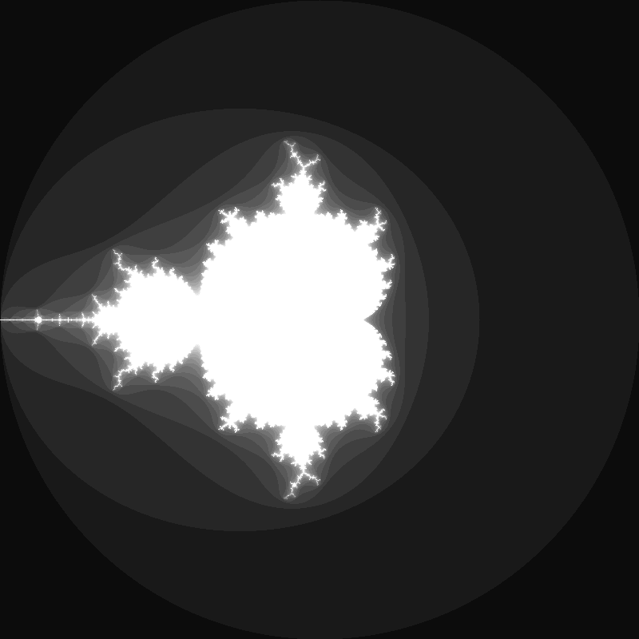
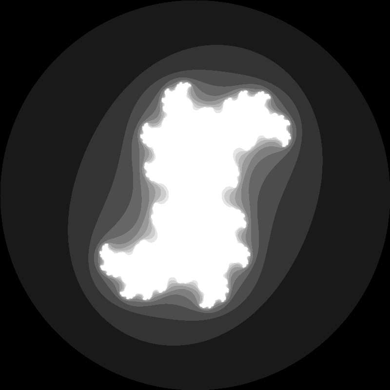
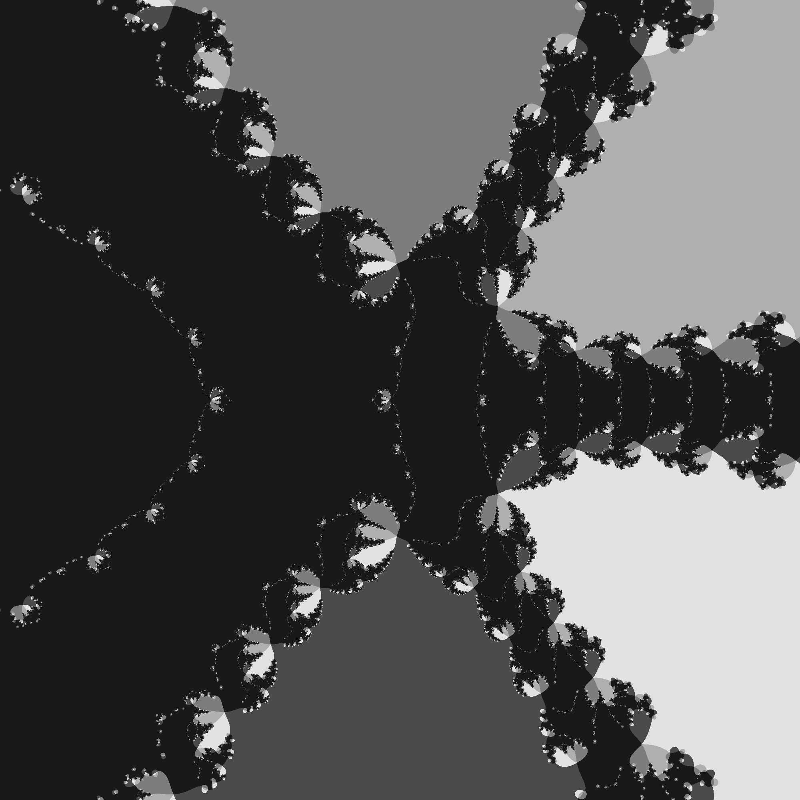

# Fractal Plotters
Various fractal plotters written in processing

## Mandelbrot Set
The set numbers $c \in \mathbb{C}$ where the the function $f(z) = z^2 +c$ does not diverge to infinity when $z$ is iterated (i.e. the sequence $|f_c(0)|, |f_c(f_c(0)))|, \dots$ remains bounded). In the default plot, this set is represented by white pixels; the grey pixels encode how quickly the function diverges when iterated. 

## Julia Sets
The set of all $z \in \mathbb{C}$ such that, for a given $c$ (a parameter to the plot), iterating $z \rightarrow z^2 + c$ does not diverge to infinity. Each point in the Mandelbrot set has a corresponding Julia set.

## Newton's Fractal
Each pixel corresponds to a $z \in \mathbb{C}$ in the complex plane. The color of the pixel corresponds to the root that this $z$ approaches when Newton's method is applied to a function $f : \mathbb{C} \rightarrow \mathbb{C}$ using $z$ as a starting point. An excellent video about Newton's fractal can be found [here](https://www.youtube.com/watch?v=-RdOwhmqP5s)

